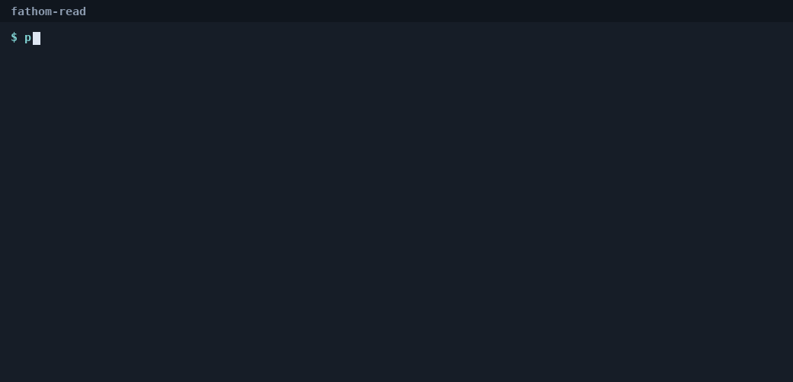

# fathom-read

**Catch the step where an AI agent contradicts a decision it already made.**

On a long task, an agent loses track of what it already decided and starts acting against it. It renames `guest_id` to `customer_id` at step 1, then writes new code against `guest_id` at step 6. The change compiles, imports, and passes the tests. It fails at runtime.

`fathom-read` turns the traces your framework already records into an action stream and sends it to the Fathom read, which reconstructs the state the agent committed and flags the step that contradicts it. Deterministic. No model access. Nothing runs in your production path.



## Install

```
pip install fathom-read
```

## Run

```
fathom demo                                              # the bundled rename example, coherent and not
fathom read trace.json --supersede guest_id=customer_id  # your own trace
fathom read history.json --format langgraph              # or name the format
fathom read trace.json --ops                             # see the action stream before anything is sent
fathom formats                                           # the formats it reads
```

`fathom read` exits 0 when the committed state is coherent and 2 when it finds a contradiction, so it drops into a test suite or a CI step as it is. Add `--json` for a machine-readable verdict.

The package ships with a demo key that is rate-limited per day. For your own key, which lifts the limit and keeps your traces on a private tier, write to [contact@embeddedriskanalytics.com](mailto:contact@embeddedriskanalytics.com?subject=fathom-read%20key) and set `FATHOM_API_KEY`. `--ops` shows exactly what would be sent: the ops the adapter produced, and nothing else.

## What it reads

| Format | What you export | How |
|---|---|---|
| `langgraph` | The checkpoint lineage | `[{"values": s.values, "step": s.metadata["step"]} for s in graph.get_state_history(config)]` |
| `openinference` | The spans Arize Phoenix stores | Export the trace's spans as JSON; only TOOL spans matter |
| `crewai` | The crew's event log | A listener on the event bus, capturing `tool_usage_finished`, `tool_usage_error`, `task_completed` |
| `letta` | Blocks, passages, and the memory-edit tool calls | `agents.blocks.list`, `agents.passages.list`, the tool calls from `agents.messages.list` |
| `dbos` | A workflow's step stream | `{"workflow_id": ..., "steps": [{"step_name", "args", "result", "ok"}]}` |
| `edits` | A coding agent's edit log | `{"initial_files": {...}, "edits": [{"tool": "str_replace_editor", "args": {...}, "ok": true}]}` |
| `events` | The native op stream | One op per line: `{"op": "set", "kind": "file", "key": "a.py", "value": "...", "ok": true}` |

Your tools have their own names. Map them once with `--map tools.json`:

```json
{"save_decision": {"op": "set", "kind": "decision", "key": "topic", "value": "text"},
 "book_seat":     {"op": "add", "kind": "flight", "key": "seats", "value": "seat"},
 "confirm_booking": {"op": "commit", "kind": "flight", "key": "booking"}}
```

## What it finds

| Finding | The agent... |
|---|---|
| `stale_reference` | acts on a fact it already removed or renamed away |
| `superseded_value` | writes or answers with a value it already replaced |
| `authored_contradiction` | reintroduces a token into a record it had already migrated |
| `residual` | ends the run with a record still carrying a value it replaced elsewhere |
| `duplicate_commit` | adds an entity a collection already holds |
| `post_commit_mutation` | changes a thing after committing it |

Every finding cites the earlier step it contradicts, so the readout is a diff between what the agent decided and what it did.

## How it reads

The read folds the agent's successful actions into a ledger of committed facts and checks every later action against the ledger. Two rules make this a reconstruction rather than a transcript. A failed action is a no-op: an edit the tool rejected leaves nothing behind. And the read consults only the agent's own actions and their results, never an answer key, so it attaches the same way on any framework. The adapters and the CLI in this repository build the action stream; the read itself runs in ERA's service.

## Use it from Python

```python
from fathom_read import Op, read

ops = [
    Op("set", "fact", "user.city", value="Denver"),
    Op("set", "fact", "user.city", value="Austin"),
    Op("answer", "fact", "user.city", value="The user lives in Denver."),
]
verdict = read(ops)          # uses FATHOM_API_KEY, or the demo key
for f in verdict.findings:
    print(f.kind, f.step, f.detail)
# superseded_value 2 step 2 answers 'Denver' for fact 'user.city', a value the agent replaced with 'Austin' at step 1.
```

## What it does not do

It does not run your agent, call a model, or need one. It does not say why the agent contradicted itself or which repair would fix it; that is the [design-partner engagement](https://embeddedriskanalytics.com/contact.html). It reads agents whose committed state lives in tool calls, checkpoints, memory writes, or edits; an agent that keeps state only in free-text logs is out of scope.

## Research

The read comes out of the Fathom program at [Embedded Risk Analytics](https://embeddedriskanalytics.com). Case studies on LangGraph, CrewAI, Letta, OpenHands, Agent-E, ContextPilot, and τ-bench are at [embeddedriskanalytics.com/research](https://embeddedriskanalytics.com/research.html). The theory is in [Records, Reflexive Modeling, and the Conditions for Stable Physical Histories](https://ssrn.com/abstract=6683578) (SSRN, 2026). See [CITATION.cff](CITATION.cff).

## Send us a trace

If you run long-horizon agents and want a readout on your own traces, send a batch: [embeddedriskanalytics.com/contact](https://embeddedriskanalytics.com/contact.html).

## License

MIT. Fathom is a trademark of Embedded Risk Analytics.
